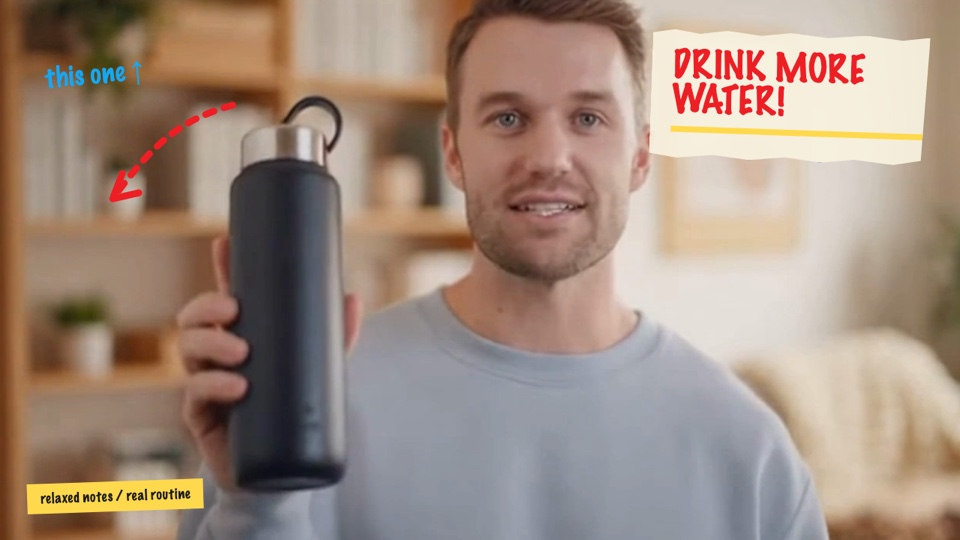

# Remotion Editing Styles

An agent skill for planning, implementing, and verifying style-directed video
edits with [Remotion](https://www.remotion.dev/).

It treats visual style as a complete editing system—not just a filter. Each
preset guides cut rhythm, typography, layout, footage treatment, captions,
transitions, overlays, recurring motifs, and sound direction.

## What it does

- Inspects source footage, project structure, format, and delivery requirements.
- Creates a structured edit plan before writing non-trivial video code.
- Recommends or applies one of five editing-style presets.
- Builds editable Remotion compositions rather than flattened mockups.
- Preserves source footage and audio unless the edit plan intentionally replaces them.
- Renders representative stills and final media for visual verification.
- Separates verified, partially verified, unverified, and failed checks.

## Included styles

| Style | Best suited for | Editing characteristics |
|---|---|---|
| Natural retro geometric | Design, culture, organic brands | Modular typography, flat organic blocks, controlled pacing |
| Xiaohongshu illustrated poster | Lifestyle, beauty, food, travel | Stickers, rounded captions, playful motion, friendly commercial energy |
| Relaxed handwritten poster | Creator opinions, emotional storytelling | Paper notes, rough arrows, conversational rhythm, human imperfection |
| American vintage color-block | Products, campaigns, courses | Rounded color blocks, badges, promotional pacing, strong CTA beats |
| Cyber brutalism | AI, software, productivity, data | HUD structure, neon-lime accents, evidence framing, precise motion |

Use one dominant preset for a normal final edit. A second preset may contribute
up to two clearly named traits.

## Real footage comparison

The following images were rendered from the same frame of one supplied
talking-head product video. Keeping the source frame constant makes the
differences in layout, typography, motifs, and editorial emphasis easier to
compare.

| Natural retro geometric | Xiaohongshu illustrated poster |
|---|---|
|  |  |

| Relaxed handwritten poster | American vintage color-block |
|---|---|
|  |  |

| Cyber brutalism |
|---|
|  |

## Workflow

```text
Inspect source
    ↓
Define audience, message, hook, proof, and CTA
    ↓
Select a dominant editing style
    ↓
Create a structured edit plan
    ↓
Build editable Remotion sequences and components
    ↓
Typecheck, preview, render stills, and inspect the final media
```

The detailed agent procedure is defined in [`SKILL.md`](SKILL.md).

## Installation

Clone directly into the Codex skills directory:

```bash
git clone git@github.com:FinchipAIOrg/remotion-editing-styles.git \
  ~/.codex/skills/remotion-editing-styles
```

Or copy this repository into another agent environment that supports the
`SKILL.md` skill format.

## Example prompts

```text
Use $remotion-editing-styles to inspect this talking-head video and recommend
the best editing style. Keep the face clear, preserve the original audio, build
an editable Remotion project, render three representative stills, and export
an H.264 MP4.
```

```text
Use $remotion-editing-styles to compare all five presets on the same source
frame, then build the selected direction as a complete edit.
```

```text
Use $remotion-editing-styles to add captions, section cards, B-roll guidance,
transitions, and a CTA to this existing Remotion composition.
```

## Edit-plan validation

The skill includes a reusable JSON plan shape:

```text
assets/edit-plan.example.json
```

Validate a plan with:

```bash
python3 scripts/validate_edit_plan.py path/to/edit-plan.json
```

The validator checks:

- Required project, creative, source, caption, audio, and validation sections.
- Positive duration, dimensions, and frame rate.
- Valid beat purposes and visual modes.
- Duplicate IDs, overlapping beats, invalid ranges, and duration overflow.
- Whether the final beat reaches the planned duration.

## Remotion starter

The reusable starter is located at:

```text
assets/remotion-style-starter/
```

Install and inspect it:

```bash
cd assets/remotion-style-starter
npm install
npm run typecheck
npm run compositions
npm run studio
```

It contains:

- A parameterized vertical motion-design composition.
- Five style-token definitions.
- Five full-duration real-footage style compositions.
- A sequential `FiveStyleEdit` comparison composition.
- Commands for rendering comparison stills and an H.264 video.

### Using real footage

The real-footage example expects:

```text
assets/remotion-style-starter/public/text-to-video-1.mp4
```

Place a local video at that path or change the `staticFile()` reference in
`RealFootageEdit.tsx`.

Source media is intentionally excluded from this repository.

Render the same-frame style comparison:

```bash
npm run still:five-styles
```

Render the sequential five-style edit:

```bash
npm run render:five-styles
```

## Repository structure

```text
remotion-editing-styles/
├── SKILL.md
├── agents/
│   └── openai.yaml
├── assets/
│   ├── edit-plan.example.json
│   └── remotion-style-starter/
├── references/
│   ├── editing-workflow.md
│   ├── remotion-implementation.md
│   ├── quality-gates.md
│   ├── style-selection.md
│   └── style-*.md
└── scripts/
    └── validate_edit_plan.py
```

## Verification expectations

Do not call an edit complete from source inspection alone.

For implementation work, verify as many of these gates as the environment
allows:

1. Edit-plan validation.
2. TypeScript or project build.
3. Composition discovery.
4. Opening, body, and CTA/end stills.
5. Face-safe placement, readable text, and valid fonts/assets.
6. Audio presence and dialogue intelligibility.
7. Final dimensions, duration, frame rate, codec, and output path.

See [`references/quality-gates.md`](references/quality-gates.md) for the full
status vocabulary and delivery checks.

## Licensing

This repository contains independently written skill instructions, validators,
style definitions, and starter code under the included MIT license.

Remotion is distributed under its own license. Review the current official
terms before commercial use or redistribution:

<https://github.com/remotion-dev/remotion/blob/main/LICENSE.md>

This project is Remotion-compatible but is not affiliated with or endorsed by
Remotion.
